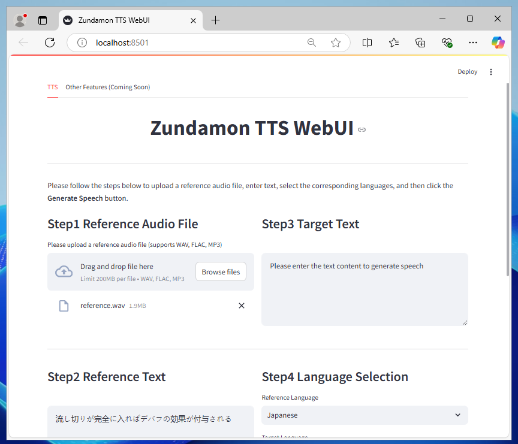

# Zundamon Speech WebUI

This repository provides an official trial version of the **Zundamon Speech WebUI**. It allows users to try **Zundamon's TTS audio generation** and explore its capabilities. **Voice changer functionality** will be added in the future.

Official website: https://zunko.jp/

## Overview

This project is based on [GPT-SoVITS](https://github.com/RVC-Boss/GPT-SoVITS) and has been adapted and fine-tuned for Zundamon's voice synthesis. The WebUI for inference is built using Streamlit, providing a user-friendly interface for generating Zundamon's speech audio files.

## Features

1. **User-Friendly Web Interface**: Easily upload reference audio and text, input your target text, and generate Zundamon's voice in your desired language.
2. **Custom Models**: Fine-tuned models specifically for Zundamon are included to provide high-quality voice synthesis.
3. **Reference Files**: Sample reference audio and text for Zundamon are provided in the `reference` folder.
4. **Download Support**: Generated audio files can be downloaded directly from the interface.
5. **Multilingual Support**: Choose from multiple languages for both reference and target text.

## Prerequisites

Before starting, ensure you have the required dependencies installed:

```bash
pip install -r requirements.txt
```

## Setup Instructions

### Step 1: Clone the Repository

```bash
git clone https://github.com/your-username/zundamon-speech-webui.git
cd zundamon-speech-webui
```

### Step 2: Download Pretrained Models

1. **Download GPT-SoVITS Pretrained Models**: Place the pretrained models in the `GPT-SoVITS/GPT_SoVITS/pretrained_models` folder:
2. **Download G2PW Models**: Download and unzip the G2PW models from [G2PWModel_1.1.zip](https://paddlespeech.bj.bcebos.com/Parakeet/released_models/g2p/G2PWModel_1.1.zip), rename the folder to `G2PWModel`, and place it in `GPT-SoVITS/GPT_SoVITS/text`.
3. **Download Zundamon Fine-Tuned Model**:
Download the fine-tuned models for Zundamon and place them in the `zundamon-speech-webui/GPT-SoVITS` folder:
    - Fine-tuned models include `GPT_weights_v2` and `SoVITS_weights_v2`.
    - Use the following commands to download and set up the models:
        
        ```bash
        git lfs install
        git clone https://huggingface.co/zunzunpj/zundamon_GPT-SoVITS
        ```
        

### Additional Requirements for Windows Installation

## How to Use the WebUI

1. Navigate to the project directory:
    
    ```bash
    cd zundamon-speech-webui
    ```
    
2. Run the WebUI using Streamlit:
    
    ```bash
    python zundamon_speech_run.py
    ```
    
3. Open the WebUI in your browser (URL will be displayed in the terminal).



### Additional Requirements for Windows Installation

1. **Download and Install FFmpeg**
    - Download and place [ffmpeg.exe](https://huggingface.co/lj1995/VoiceConversionWebUI/blob/main/ffmpeg.exe) and [ffprobe.exe](https://huggingface.co/lj1995/VoiceConversionWebUI/blob/main/ffprobe.exe).
    - Place them in the root directory of `zundamon-speech-webui/GPT-SoVITS`.
2. **Install Visual Studio Build Tools**
    - Visit the [Visual Studio Download Page](https://visualstudio.microsoft.com/visual-cpp-build-tools/).
    - Download and install "Visual Studio Build Tools".
    - During installation, select "Desktop development with C++".
3. **Install CMake**
    - Visit the [CMake Official Site](https://cmake.org/download/).
    - Download and install the Windows version of CMake.
    - During installation, choose "Add CMake to the system PATH".

## How to Generate Zundamon's Voice Audio

1. **Upload Reference Files**
    - **Step 1: Reference Audio File** Upload a sample audio file for Zundamon's voice (`.wav`).
    - **Step 2: Reference Text** Provide or upload a text file that corresponds to the reference audio file.
2. **Input Target Details**
    - **Step 3: Target Text** Enter the text you want to synthesize in Zundamon's voice.
    - **Step 4: Language Selection** Select the language for both reference and target text.
3. **Generate Audio**
    
    Click the **Generate Speech** button. After processing, the synthesized audio will be displayed with options to preview and download.
    

## Sample Reference Files

A sample reference audio file and corresponding text for Zundamon are included in the `reference` folder. Feel free to use them to test the WebUI.

For additional Zundamon voice resources, visit the official download page:

https://zunko.jp/multimodal_dev/login.php

## License Information

This software includes the following open-source software:

- [GPT-SoVITS](https://github.com/RVC-Boss/GPT-SoVITS) (MIT License)
- [GPT-SoVITS Pretrained Models](https://huggingface.co/lj1995/GPT-SoVITS) (MIT License)
- [G2PW Model](https://github.com/GitYCC/g2pW) (Apache 2.0 License)
- [UVR5 (Voice Cleaning)](https://huggingface.co/lj1995/VoiceConversionWebUI/tree/main/uvr5_weights) (MIT License)
- [Faster Whisper Large V3](https://huggingface.co/Systran/faster-whisper-large-v3) (MIT License)

These are provided under their respective license terms.